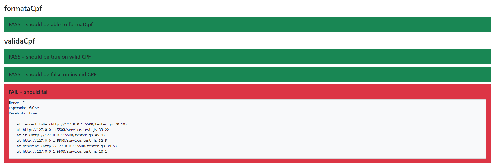

<h1 align="center">DIY JS Tester</h1>
<h3 align="center">Por André Altoé</h3>

  

<!-- TABLE OF CONTENTS -->
<h2 id="summary"> :book: Sumário</h2>

  
Sumário

  <ol>
    <li><a href="#sobre"> ➤ Sobre</a></li>
    <li><a href="#tecnologias"> ➤ Tecnologias</a></li>
     <li><a href="#como-rodar"> ➤ Como Rodar e criar testes</a></li>
    <li><a href="#creditos"> ➤ Creditos</a></li>
  </ol>

<!-- ABOUT THE PROJECT -->
<h2 id="sobre"> :pencil: Sobre</h2>

Com o intuito de trazer uma forma leve, prática e fácil de testar funções feitas com javascript, essa é uma implementação extremamente básica e inicial que tem como inspiração o Jest. Podendo ser utilizada para fins de desafio ou até mesmo em aplicações de menor escala que utilizam apenas do JS rodando diretamente pelo browser.

<!-- PROJECT TECHNOLOGIES -->
<h2 id="tecnologias"> :hammer: Tecnologias</h2>

<ul>
    <li>HTML
    <li>Javascript
    <li>Bootstrap
</ul>

<!-- HOW TO RUN -->
<h2 id="como-rodar"> :nut_and_bolt: Como Rodar e criar testes</h2>

Para criar um teste, basta fazer uma descrição com
<pre><code>describe('funcaoTal', () => {
        ...
})
</code></pre>

Dentro da função anônima serão descritos os casos de teste como o exemplo a seguir que chama uma função que retorna um array e compara o resultado com o esperado.

<pre><code>it('must return this array', () => {
    const result = stringArray();
    assert(result).toEqual(['hello', 'world']);
})
</code></pre>

Atualmente existem 3 tipos de comparação e 1 modificador

Comparações:
<ul>
    <li> <code>toBe()</code>: Comparação entre objetos (utiliza Object.is())
    <li> <code>toBeCloseTo()</code>: Comparação entre números com arredondamento
    <li> <code>toEqual()</code>: Comparação utilizando JSON.strigify
</ul> 

Modificador:
<ul>
    <li> <code>not()</code>: Negação
</ul>

<!-- CREDITS -->
<h2 id="creditos"> :eyeglasses: Creditos</h2>

> Feito com 💙 Por André Altoé :wave:

